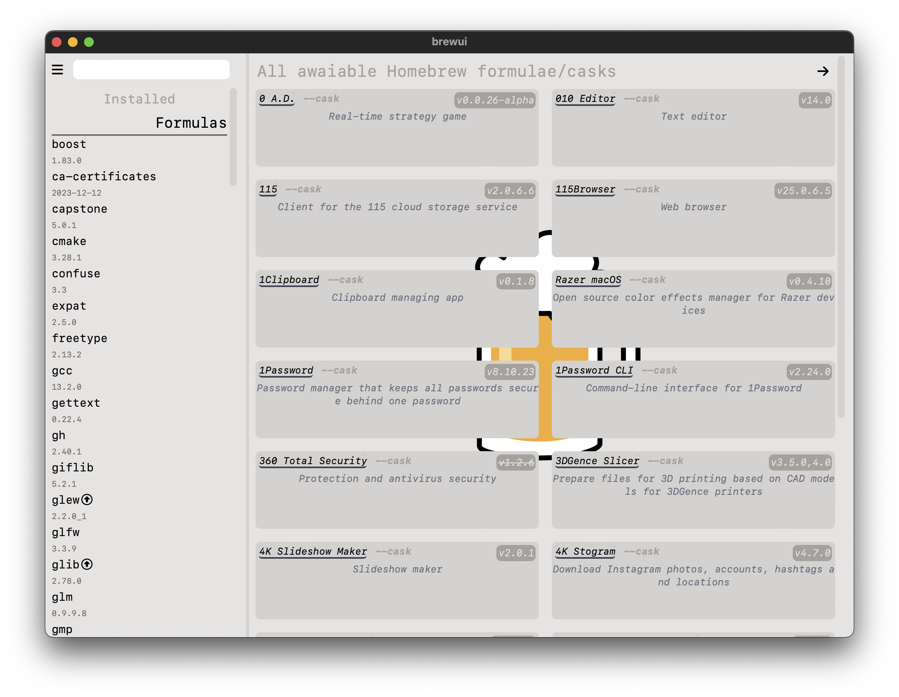
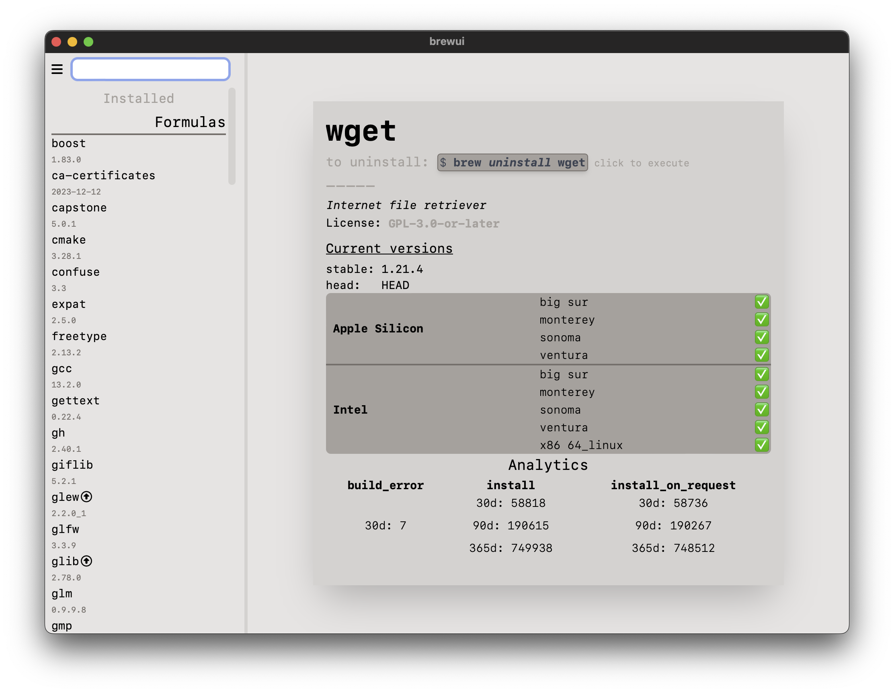
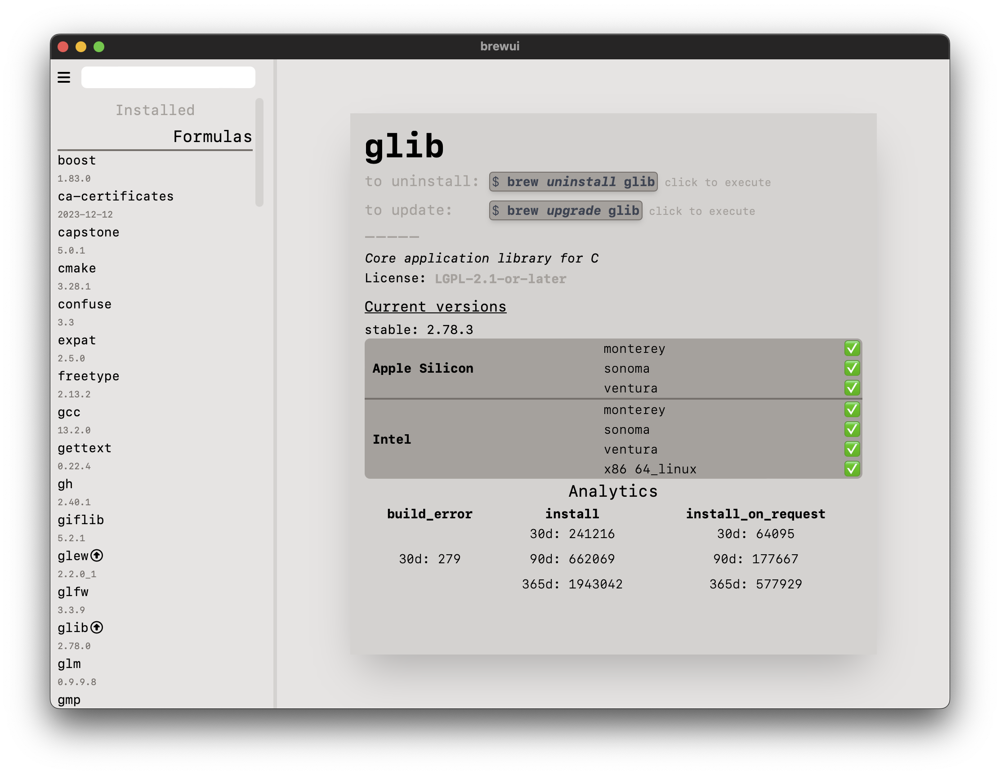
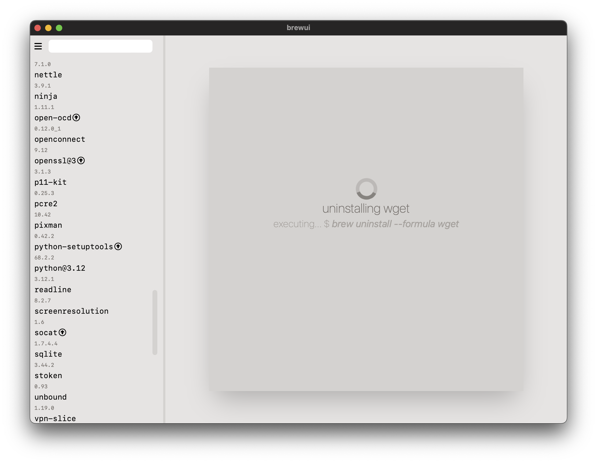

# brewui

Simple UI for Homebrew package manager powered by Tauri and Vue.

## Notes

This project is accualty my first project with Tauri and also Vue, and i can't say that i am very good at Rust and **espicially** in Typescript, but i think i did pretty good job for first time.
Because of its made of Rust, it is very normal to think its **blazingly fast** but unfortunatly it isnt :( but one that it will.

## Build

Just download the sources and run with **npm** thats should be enough.

## Screenshots

### Main Menu

### Info Menu

### Installing

### Updating

### Uninstalling
