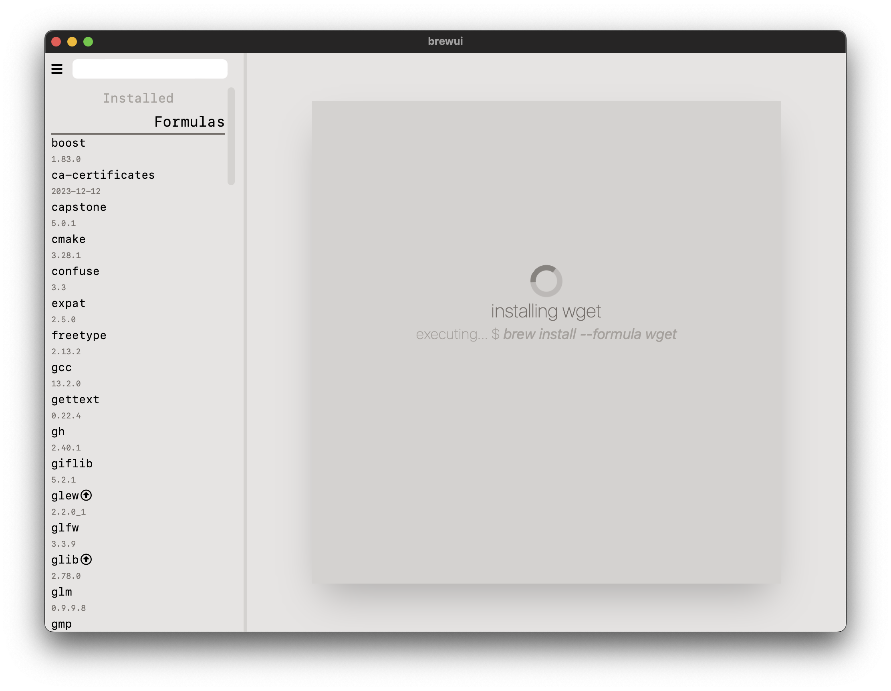

# brewui

Simple UI for Homebrew package manager powered by Tauri and Vue.

> This project is actually my first project using Tauri and Vue, and i can't say that I am very good at Rust and **especially** in Typescript, but I think I did a pretty good job for the first time.
Since it's written in Rust, you might think it's **blazingly fast** but unfortunately it isn't :( . One day it will though.

## Build

Just download the source and run with **npm** that should be enough.

## Screenshots

### Main Menu

### Info Menu

### Installing

### Updating

### Uninstalling

